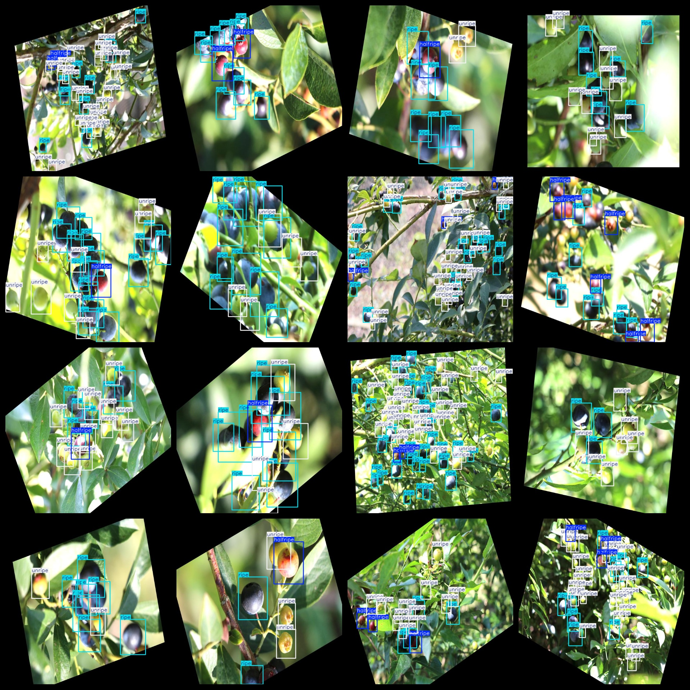

# Blueberry Ripeness Detection Dataset 9115 imagesVOC+YOLO format（(Augmented) ）

The dataset of blueberry maturity detection contains 9115 images in VOC+YOLO format (enhanced)

Dataset format: Pascal VOC format + YOLO format (the txt file does not contain the split path, it only contains jpg images and corresponding VOC format xml files and yolo format txt files)

Number of images (number of jpg files): 9115

Number of xml files: 9115

Number of txt files: 9115

Number of annotated categories: 3

The Github repository is: datasets_sl

["halfripe","ripe","unripe"]

Number of boxes labeled in each category:

halfripe frame count = 13587

The number of ripe frames is 85137.

unripe frame count = 63186

Total frame count: 161910

Number of images per category:

halfripe annotated images = 4967

ripe annotated images = 9115

unripe annotated images = 7855

Image resolution: 640x640

Use the labeling tool: labelImg

Dataset Enhancing: Yes (Enhancements are significant)

Rules for annotation: Draw a rectangle around the category.

Important note: The dataset does not have been divided into training, validation, and testing sets.

Special Disclaimer: This dataset does not guarantee the accuracy of the trained models or weight files.

Annotation and image details are as follows:

## Images

---

Here is a pay link on Stripe (https://buy.stripe.com/3cs8yP7sY87d0vu9AB). Please contact me lonlonago@foxmail.com after funding $89, and I will send you a complete data files, thank you!

